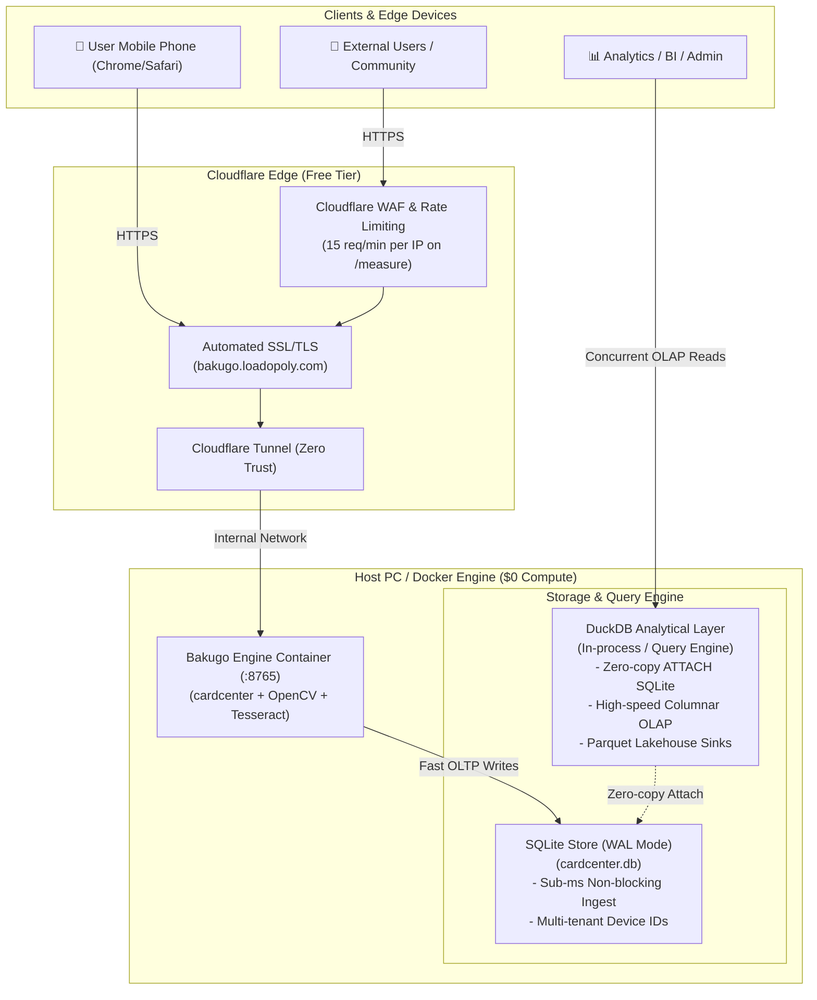

# Zero-Cost Production Deployment & DuckDB Architecture Guide

This document outlines the optimal architecture for running **Bakugo (`cardcenter`)** on **`bakugo.loadopoly.com`** at **$0.00 / month** with high concurrency for both private mobile use and public external users, replacing Supabase with **DuckDB**.

---

## 1. System Architecture Overview



---

## 2. Cost Analysis Breakdown ($0.00 / Month)

| Component | Selected Solution | Cloud Alternative | Monthly Savings | Rationale |
| :--- | :--- | :--- | :--- | :--- |
| **Hosting / Compute** | Local Docker Engine (`bakugo:dev`) | AWS EC2 / Render ($15–$45/mo) | **$15–$45** | Utilizes existing machine hardware; zero idle compute bills. |
| **Domain & Ingress** | Cloudflare Tunnel (Zero Trust Free) | AWS ALB + NAT Gateway ($30+/mo) | **$30+** | Free SSL, unlimited bandwidth, zero open inbound firewall ports. |
| **Database** | SQLite WAL + DuckDB OLAP | Supabase Pro / RDS ($25–$60/mo) | **$25–$60** | Embedded, serverless, zero DBaaS monthly fees or overage charges. |
| **DDoS & Protection** | Cloudflare Free WAF & Bot Fight | Enterprise Cloud WAF ($200+/mo) | **$200+** | Shields OpenCV/Tesseract CPU endpoints from brute-force floods. |
| **Total** | **$0.00 / month** | **$70 – $335+ / month** | **100% Free** | **Zero infrastructure operating expenditure.** |

---

## 3. Database Strategy: Replacing Supabase with DuckDB

### The Challenge
* **Supabase** (PostgreSQL + PostgREST) handles network connections out-of-the-box but adds external cloud dependencies and recurring hosting costs.
* **DuckDB** is an embedded columnar OLAP database with a **single-writer file lock**. If multiple external users post card images concurrently, direct multi-process DuckDB writes will encounter lock contention.

### The Solution: The Hybrid Ingest + Analytical Engine Pattern

1. **Transactional Ingestion Path (OLTP)**:
   * Bakugo writes incoming measurement metadata to local SQLite configured in **Write-Ahead Logging (WAL) Mode** (`PRAGMA journal_mode=WAL;`).
   * SQLite WAL allows **unlimited concurrent readers** while a write occurs, with sub-millisecond transaction duration.
2. **Analytical & Multi-Connection Path (OLAP via DuckDB)**:
   * External queries, analytics dashboards, and batch scripts query the database via DuckDB using DuckDB's native SQLite scanner:
     ```python
     import duckdb

     # Attach the live SQLite database without locking active scans
     con = duckdb.connect()
     con.execute("INSTALL sqlite; LOAD sqlite;")
     con.execute("ATTACH '/data/cardcenter.db' AS cc (TYPE SQLITE);")

     # Run high-performance aggregations over hundreds of thousands of scans
     df = con.execute("""
         SELECT 
             card_key,
             COUNT(*) as total_scans,
             AVG(worst_ratio_pct) as avg_centering,
             APPROX_COUNT_DISTINCT(phash) as distinct_cards
         FROM cc.scans
         GROUP BY card_key
         ORDER BY total_scans DESC
     """).df()
     ```
3. **Parquet Lakehouse Sync (Optional)**:
   * Sinks scan metadata into partitioned `.parquet` files (`/data/scans/year=2026/month=08/`) for completely decentralized, lock-free queries.

---

## 4. Multi-Tenant User Isolation & Data Provenance

When external users interact with the public endpoint:

1. **Client Tenant Tracking**:
   * Frontend generates a persistent device UUID in `localStorage` and submits it via `X-Device-ID` header.
   * Scans are stored with index `idx_scans_tenant ON scans(device_id, created_at)`.
2. **Contamination Firewall**:
   * Ground-truth machine learning models only train on `LabelKind.CERTIFIED` (verified third-party slab cert numbers).
   * External public inputs default to `LabelKind.SELF_REPORTED` or `MARKETPLACE_VOTE`, ensuring user crowd-data never pollutes the core metrology models.

---

## 5. Step-by-Step Deployment Guide

### Step 1: Configure Cloudflare Tunnel Ingress

In [`Loadopoly-OCR/cloudflared/config.yml`](file:///c:/Users/agard/Documents/VS%20Code/Loadopoly-OCR/cloudflared/config.yml):

```yaml
tunnel: <TUNNEL_UUID>
credentials-file: /etc/cloudflared/credentials.json

ingress:
  - hostname: bakugo.loadopoly.com
    service: http://bakugo:8765
  - hostname: loadopoly.com
    service: http://loadopoly-ocr:3000
  - hostname: www.loadopoly.com
    service: http://loadopoly-ocr:3000
  - service: http_status:404
```

### Step 2: Route DNS in Cloudflare

1. In the **Cloudflare Dashboard** → **DNS Records**:
   * Add `CNAME` record:
     * **Name**: `bakugo`
     * **Target**: `<TUNNEL_UUID>.cfargotunnel.com`
     * **Proxy Status**: Proxied (Orange Cloud)
2. In **SSL/TLS**: Set mode to **Full** or **Strict**.

### Step 3: Configure Cloudflare Rate Limiting (Protection)

1. Navigate to **Security** → **WAF** → **Rate limiting rules**.
2. Create rule:
   * **Expression**: `(http.host eq "bakugo.loadopoly.com" and http.request.uri.path eq "/measure")`
   * **Rate**: 15 requests per 1 minute per IP.
   * **Action**: Block (1 minute) or Managed Challenge.

### Step 4: Launch the Production Docker Stack

Run the stack in detached mode:

```powershell
# From the repository root
cd "c:\Users\agard\Documents\VS Code\Loadopoly-OCR"
docker compose --profile named-tunnel up -d
```

### Step 5: Verify Mobile Access

1. Open **`https://bakugo.loadopoly.com`** on mobile Chrome or Safari.
2. Verify:
   * Green padlock (TLS active).
   * Camera prompt opens rear sensor on **Measure a card**.
   * Instant measurement returns centering ratio and grade bands.
   * Scans persist to `/data/cardcenter.db`.
