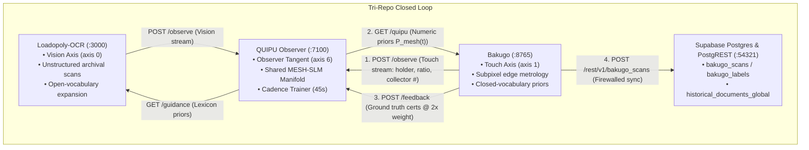

# System Dynamics — Bakugo (Touch Axis & Metrology Hub)

Version: 2.4.0  
Date: 2026-08-20  

---

## 1. System Role in the Tri-Repo Mesh

In the unified multi-repo architecture, **Bakugo** (`cardcenter`) operates as the **Touch Sense Axis** ($\text{axis}=1$), providing the physical, geometric, and closed-vocabulary metrology constraints that balance the open-vocabulary exploration of the **Vision Sense Axis** (`Loadopoly-OCR`). Both feeds converge in **QUIPU** (the 7th-dimensional Observer learning hub) and mirror metadata to **Supabase**.



### Contrast of Sense Complementarity

| Attribute | Vision Axis (`Loadopoly-OCR`) | Touch Axis (`Bakugo`) |
| :--- | :--- | :--- |
| **Geometry** | Flexible 2D/3D document poses, variable DPI | Rigid planar rectangles, calibrated mm scale |
| **Vocabulary** | Open-vocabulary archival & historical tokens | Closed catalog sets, strict collector numbers |
| **Measurement** | Probabilistic OCR transcriptions | Deterministic subpixel step gradients & ratio intervals |
| **Dynamical Role**| Expands state space & discovers novel tokens | Damps variance, enforces geometry & provides hard priors |

---

## 2. Metrology & Mathematical Controls

### 2.1. Centering Ratio & Confidence Bounds
Card centering is the ratio of opposing border widths. For an axis with left/right borders $l, r \in \mathbb{R}^+$:
$$w = \frac{\max(l, r)}{l + r} \times 100\%$$
Because border detection includes subpixel line-fitting variance $\sigma_l^2, \sigma_r^2$, the uncertainty propagation yields:
$$\sigma_w = \frac{100}{(l + r)^2} \sqrt{r^2 \sigma_l^2 + l^2 \sigma_r^2}$$
$$w_{interval} = \left[ w - 1.96 \cdot \sigma_w, \; w + 1.96 \cdot \sigma_w \right] \quad (95\%\text{ confidence})$$

### 2.2. Multi-Layer Refraction Compensation (Snell's Law)
When scanning cards inside graded slabs or acrylic cases, the dielectric stack bends optical rays. In-plane apparent corner displacement $\delta$ is compensated via:
$$\sin \theta_{air} = n_{slab} \sin \theta_{slab}$$
$$\delta = t \cdot \left( \tan \theta_{air} - \tan \theta_{slab} \right)$$
Where $t$ is the slab wall thickness and $n_{slab} \approx 1.491$ for PMMA / 1.586 for Polycarbonate.

### 2.3. Temporal-Spatial Inverse-Variance Fusion
In AR/video capture, consecutive frames $w_i \pm \sigma_i$ are fused into a running estimate with $\chi^2/\text{dof}$ goodness-of-fit inflation:
$$w_{fused} = \frac{\sum_{i=1}^N w_i / \sigma_i^2}{\sum_{i=1}^N 1 / \sigma_i^2}$$
$$\sigma_{fused}^2 = \frac{1}{\sum_{i=1}^N 1 / \sigma_i^2} \times \max\left(1.0, \; \frac{1}{N-1}\sum_{i=1}^N \frac{(w_i - w_{fused})^2}{\sigma_i^2}\right)$$

---

## 3. Observer Interaction & Cross-Corpus Learning

### 3.1. Feeding Observations (`POST /observe`)
Whenever a measurement completes, `cardcenter.quipu_client` asynchronously posts structured measurements to QUIPU's touch axis (`bakugo/code/hideout-mesh`):
```json
{
  "source": "bakugo",
  "kind": "structured",
  "text": "card centering scan holder psa axis horizontal wider left ratio 54.2 psa band 9 collector number 025",
  "confidence": 0.94,
  "meta": { "holder": "psa", "ratio": 54.2, "px_per_mm": 28.4 }
}
```

### 3.2. Disambiguating Collector Numbers (`GET /guidance`)
When OCR on small, low-contrast collector numbers yields multiple ambiguous candidates (e.g. `025` vs `028`), Bakugo weights candidates by cross-corpus mesh frequencies:
$$P_{mesh}(t) = \frac{\text{freq}(t)}{\sum_{t' \in \mathcal{V}_{num}} \text{freq}(t')}$$
Tokens verified across both archival documents (Vision) and prior card scans (Touch) receive higher prior weight, resolving ties without requiring network LLM inference.

### 3.3. Ground-Truth Reinforcement (`POST /feedback`)
When physical slab labels are confirmed with verified certification numbers, Bakugo reports ground truth to QUIPU. The observer feeds the confirmed sequence twice ($2\times$) into the MESH-SLM bigram matrix, ensuring ground truth dominates misreadings.

---

## 4. Cloud Persistence & Contamination Firewall

### 4.1. Local ScanStore as Source of Truth
All measurements, border coordinates, subgrades, and image hashes are stored first in local SQLite (`/data/cardcenter.db` or `cardcenter.db`).

### 4.2. Supabase PostgREST Metadata Sync
Scans and verified labels are mirrored to the shared Supabase project:
- `bakugo_scans`: Measurement metadata (worst ratio, axes, mm borders, phash, device ID).
- `bakugo_labels`: Grade outcomes and certification metadata.

### 4.3. The Contamination Firewall Rule
To prevent circular model degradation, self-reported grades and unverified claims are blocked from training models:
```sql
CONSTRAINT bakugo_labels_certified_needs_cert CHECK (
    kind <> 'certified'
    OR (cert_number IS NOT NULL AND length(trim(cert_number)) > 0)
);
```
Unverified entries are rejected at the edge before any database write occurs.

---

## 5. World Model Grounding — Physical-Space Channel Teaching (v2.4.0)

Bakugo enriches every observation sent to the QUIPU Observer with **world-model grounding metadata** (`cardcenter/world_model_grounding.py`) that teaches the Observer how information is lost in the physical measurement channel.

### 5.1. Information Efficiency
The ratio of the Cramér-Rao lower bound $\sigma_{CRB}$ to the achieved measurement uncertainty $\sigma$:
$$\eta = \min\!\left(1.0, \; \frac{\sigma_{CRB}}{\max(\sigma, 10^{-12})}\right)$$
$\eta = 1.0$ means the detector is operating at the fundamental physical limit. Lower values indicate information loss from blur, noise, refraction, or glare.

### 5.2. Lossy Channel Profile
Each observation carries a list of physical degradation factors detected in the channel:
- **blur**: PSF sigma exceeds the Nyquist sampling floor
- **noise**: Sensor noise dominates the edge contrast
- **refraction**: Multi-layer dielectric (PMMA $n{=}1.491$, PC $n{=}1.586$) bends optical rays
- **glare**: Specular reflection saturates pixel rows
- **quantization**: Pixel pitch below 4.5 px/mm insufficient for subgrade resolution

### 5.3. Physical Invariant Accumulation
Over time, Bakugo accumulates repeatable geometric truths:
- Refractive indices for known holder materials (PSA → PMMA, BGS/CGC → PC)
- Mean information efficiency across measurement sessions
- Distribution of dominant lossy channel factors

These priors are persisted in `.world_model.json` and included in every observation so the Observer can build a grounded physical World Model that understands how lossy the real world is compared to digital acquisition.

### 5.4. VLM Training Pathway
As Bakugo accumulates more physical-card AR metrology → the Observer trains VLM (Vision-Language Model) priors about:
- How card geometry appears through different holder materials
- What information survives optical stacking vs what is irreversibly lost
- How measurement uncertainty maps to the $\chi^2/\text{dof}$ consistency metric

This creates a **precedent-driven retrieval flywheel**: more physical measurements → better physical priors → more targeted epistemic queries → improved World Model comprehension.

---

## 6. Observability & Verification Telemetry

```bash
# 1. Check Bakugo web server and available holders
curl -s http://127.0.0.1:8765/holders | jq .

# 2. Inspect active link to QUIPU Observer and received numeric priors
curl -s http://127.0.0.1:8765/quipu | jq .

# 3. Query mirrored scans in Supabase PostgREST
curl -s -H "apikey: $SUPABASE_ANON_KEY" \
     -H "Authorization: Bearer $SUPABASE_ANON_KEY" \
     "http://127.0.0.1:54321/rest/v1/bakugo_scans?select=*,bakugo_labels(*)" | jq .

# 4. Check physical world model grounding summary
python -c "from cardcenter import world_model_grounding; import json; print(json.dumps(world_model_grounding.physical_world_summary(), indent=2))"
```
